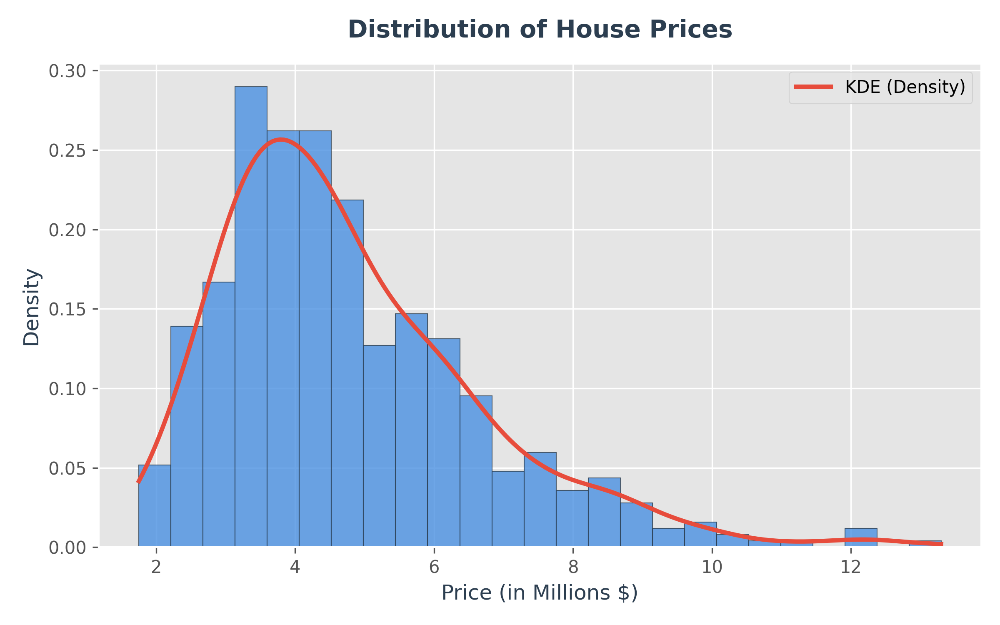
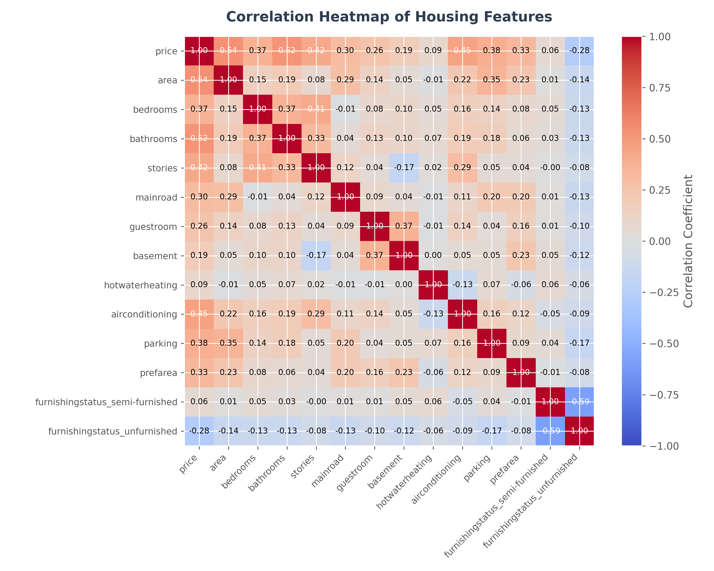
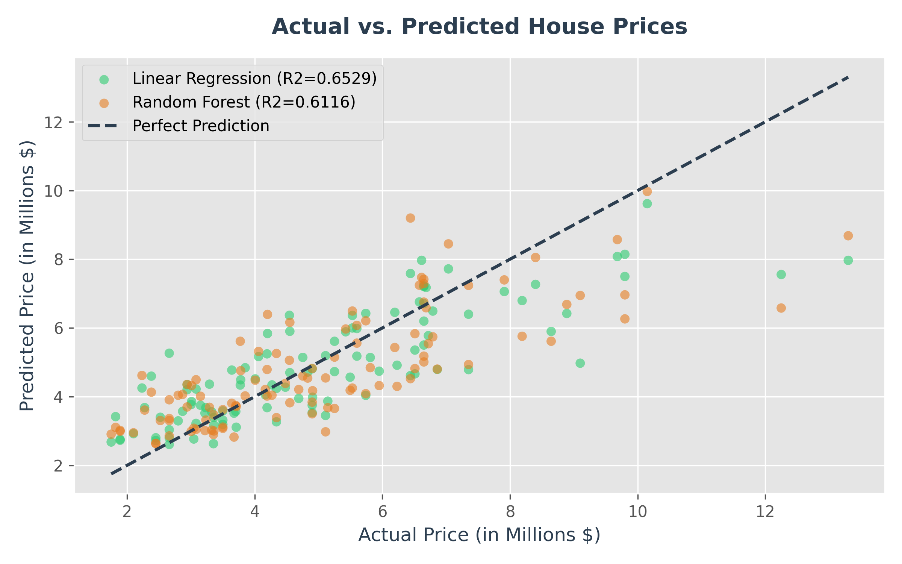

# XYlofy AI - Internship Project 1: House Price Prediction

[](https://www.python.org/)
[](https://scikit-learn.org/)
[](https://opensource.org/licenses/MIT)

An end-to-end data science and machine learning project to predict residential house prices using structural features, location indicators, and utilities. This project was developed as part of the **Week 1 Internship Assignment** at **XYlofy AI**.

---

## 🎯 Project Overview & Objectives
Real estate buyers, sellers, and agents often rely on subjective valuations, leading to pricing inefficiencies. The objective of this project is to build an automated, data-driven regression engine that:
1. **Predicts property prices** based on key attributes (area, bedrooms, bathrooms, stories, amenities).
2. **Evaluates and compares** a baseline **Linear Regression** model and a **Random Forest Regressor**.
3. **Extracts actionable business insights** to assist real estate firms in maximizing their pricing strategies and ROI.

---

## 📁 Repository Structure
The project is organized as follows:
```text
XYlofyAI-Internship-Project1/
├── HousePricePrediction_RishiSrivastava/   # Core Submission Deliverables
│   ├── Housing.csv                          # Raw dataset containing 545 entries
│   ├── analysis.ipynb                       # Jupyter notebook with pre-rendered outputs
│   ├── summary.pdf                          # 1-page executive summary report
│   └── charts/                              # High-resolution visual assets
│       ├── price_distribution.png
│       ├── correlation_heatmap.png
│       └── actual_vs_predicted.png
├── .gitignore                               # Standard git ignore configurations
├── README.md                                # Project presentation page (this file)
├── project_overview.md                      # Detailed context and briefs
├── plan.md                                  # Step-by-step implementation methodology
└── project_logs.md                          # Interactive activity and execution logs
```

---

## 📊 Dataset Features
The model operates on a dataset containing **545 homes** with **13 columns**:
* **Target:** `price` (Sale price of the house)
* **Numeric Predictors:** `area` (sqft), `bedrooms`, `bathrooms`, `stories`, `parking`.
* **Amenities & Utilities:** `mainroad`, `guestroom`, `basement`, `hotwaterheating`, `airconditioning`, `prefarea` (Preferred neighborhood).
* **Furnishing Status:** `furnishingstatus` (Categorical: furnished, semi-furnished, unfurnished).

---

## 📈 Model Performance & Evaluation
We split the cleaned dataset into **80% training** and **20% testing** sets. The baseline **Linear Regression** model slightly outperformed the **Random Forest Regressor** on this testing split:

| Model Type | Mean Absolute Error (MAE) | Root Mean Squared Error (RMSE) | R² Score (Variance Explained) |
| :--- | :---: | :---: | :---: |
| **Linear Regression (Baseline)** | **$970,043.40** | **$1,324,506.96** | **0.6529** |
| **Random Forest Regressor** | **$1,028,648.01** | **$1,401,052.04** | **0.6116** |

### Key Observations
* **Linear Structure:** The high performance of the Linear Regression model suggests that housing prices in this region exhibit strong linear relationships with physical dimensions and utility upgrades.
* **Random Forest Fit:** While Random Forest handles complex interactions well, it exhibited slight overfitting on this relatively small dataset (545 rows).

---

## 📊 Visualized Insights

### 1. Price Distribution
The dataset shows a positive skew in home valuations, with most property listings clustered between $2M and $6M.


---

### 2. Feature Correlations
The heatmap reveals that **area** (0.54), **bathrooms** (0.52), and **airconditioning** (0.45) have the strongest positive correlations with price.


---

### 3. Actual vs. Predicted Prices
This plot displays how predictions from both models align relative to a perfect prediction line ($y = x$).


---

## 💡 Executive Insights & Business Value
* **Primary Drivers:** Total square footage (`area`), numbers of bathrooms, and stories are the dominant pricing drivers.
* **AC Premium:** Central air conditioning is heavily correlated with pricing premiums. Installing central AC is a high-ROI upgrade path for property flippers.
* **Valuation Application:** The Linear Regression model is robust enough to serve as an initial automated valuation tool for pricing listings within a ±15% margin of error on average.

---

## 🛠️ How to Run Locally

### Prerequisites
Make sure you have Python 3.10+ installed.

### Setup and Libraries
Install the required packages:
```bash
pip install pandas numpy scikit-learn matplotlib fpdf2
```

### Execution
1. Clone this repository:
   ```bash
   git clone https://github.com/Mercer18/XYlofyAI-Internship-Project1.git
   cd XYlofyAI-Internship-Project1
   ```
2. Navigate to the core deliverables directory and open `analysis.ipynb` in VS Code or Jupyter Notebook:
   ```bash
   cd HousePricePrediction_RishiSrivastava
   jupyter notebook analysis.ipynb
   ```
3. Run all cells to replicate the models, evaluations, and visualizations.
